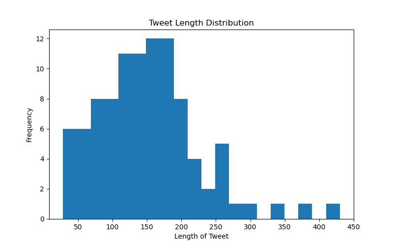
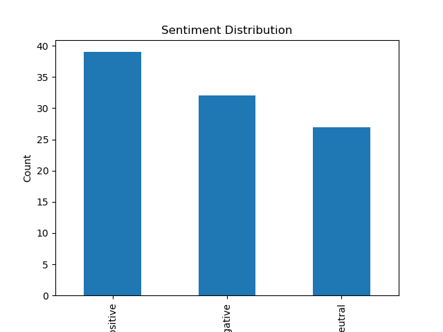
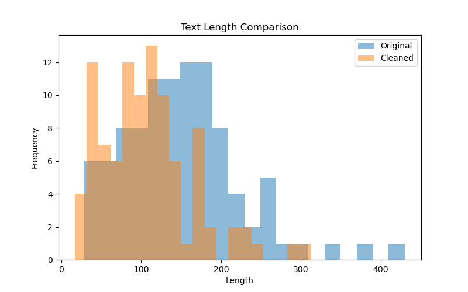
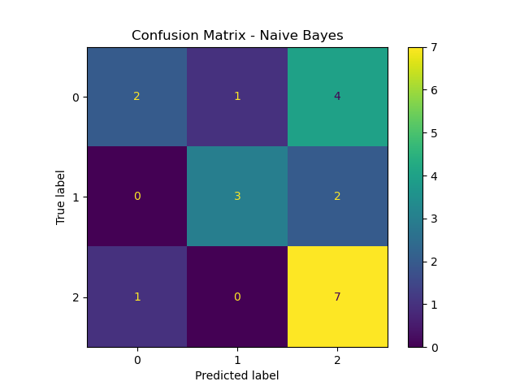
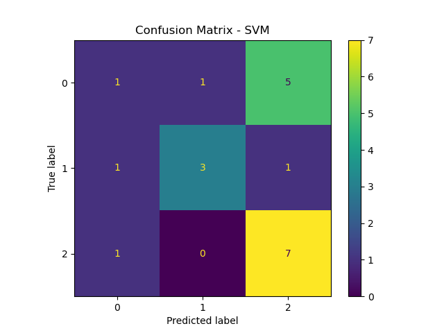
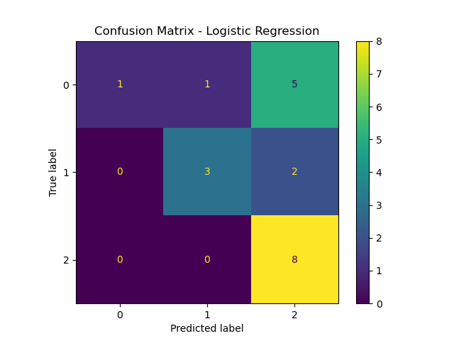
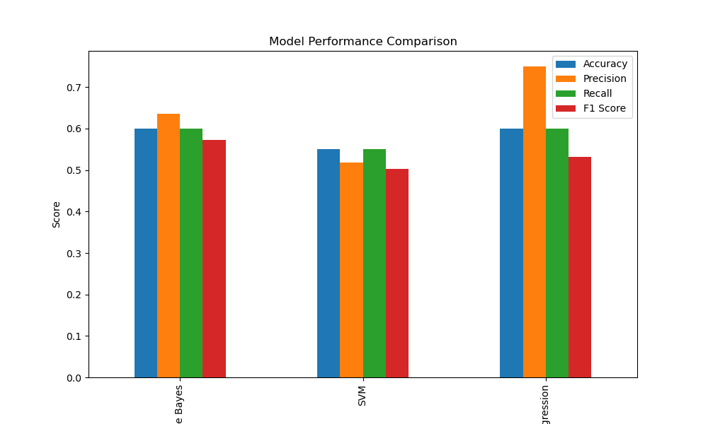

# 📱 Sentiment Analysis: Is Android better than iPhone?

## 👨‍💻 Author

* Name: Girish Dayaghan Sakpal
* UIN: 231A011
* Roll Number: 49
* Class: TE - AI&DS
* Subject: Data Analytics and Visualization (Assignment 02) - 2025-2026

---

## 📊 Project Overview

* Social media platforms like Twitter provide valuable insights into public opinion.

* This project performs **sentiment analysis** on tweets related to:

  * **“Is Android better than iPhone?”**

* The goal is to classify tweets into:

  * Positive
  * Negative
  * Neutral

---

## 🗂 Dataset

* The dataset consists of approximately **100 tweets** related to Android vs iPhone.

### Features:

* **Tweets** → Tweet content
* **Posted-by** → Tweet Owner
* **Label/Sentiment** → Positive / Negative / Neutral

### Sample Dataset Content

| Tweets | Posted by | Label |
|------|------|------|
| Android gives way more flexibility and options. | TechHelpIndia | positive |
| The iPhone edges it out as the best here—polished ecosystem, buttery-smooth experience, and long-term reliability | grok | negative |
| I use iPhone and android as a daily driver... iPhone is best for security... UI stuff android is always better. | MrAwesomeSays | neutral |
| Android is better than iPhone btw | DuskJohn1 | positive |
| OS-wise iOS is still the best OS that a mobile phone can have. | ibharath | negative |

### Tweets Lenght Distribution in Dataset
<p align="center">
  
</p>

### Sentiment Distribution in Dataset
<p align="center">
  
</p>


---

## ⚙️ Technologies Used

* Python
* Pandas
* NumPy
* Matplotlib
* NLTK
* Scikit-learn

---

## 🔧 Methodology

### 1️⃣ Data Cleaning

* Removed missing values and duplicates
* Selected relevant columns

---

### 2️⃣ Text Preprocessing

* Lowercasing
* Removed:

  * URLs
  * Mentions
  * Hashtags
  * Punctuation
* Stopword removal
* Lemmatization

---

## 📷 Preprocessing Visualization

<p align="center">
  
</p>

---

### 3️⃣ Feature Extraction

* TF-IDF Vectorization
* Unigrams + Bigrams

---

### 4️⃣ Model Implementation

* **Naive Bayes** → Fast probabilistic classifier
* **SVM** → Optimal decision boundary
* **Logistic Regression** → Balanced model

---

## 📊 Results

* **Naive Bayes**

  * Accuracy: 0.60
  * Precision: 0.636
  * Recall: 0.60
  * F1 Score: 0.573

<p align="center">
  
</p>

---

* **SVM**

  * Accuracy: 0.55
  * Precision: 0.519
  * Recall: 0.55
  * F1 Score: 0.503

<p align="center">
  
</p>

---

* **Logistic Regression**

  * Accuracy: 0.60
  * Precision: 0.750
  * Recall: 0.60
  * F1 Score: 0.532

<p align="center">
  
</p>

---

## 📊 Model Comparison

### 🔢 Final Weightage Formula

```
Final Score = 0.4(F1 Score) + 0.3(Precision) + 0.3(Recall)
```

* F1 Score is given higher weight as it balances precision and recall
* Precision and Recall are equally weighted for fair evaluation

---

### 📋 Comparison Table

| Model               | Accuracy | Precision | Recall | F1 Score | Final Score |
| ------------------- | -------- | --------- | ------ | -------- | ----------- |
| Naive Bayes         | 0.60     | 0.636     | 0.60   | 0.573    | 0.6000      |
| SVM                 | 0.55     | 0.519     | 0.55   | 0.503    | 0.5219      |
| Logistic Regression | 0.60     | 0.750     | 0.60   | 0.532    | 0.6178      |

---

<p align="center">
  
</p>

---

## 📌 Best Model

👉 **Logistic Regression**

* Highest Final Score: **0.6178**
* Best balance of precision and recall

---

## 📁 Project Structure

```
data/
notebooks/
results/
visuals/
report_and_declaration/
```

📄 Detailed structure: [structure.txt](structure.txt)

---

## 📌 Key Insights

* Accuracy alone is not sufficient
* F1 score and weighted evaluation give better insight
* Logistic Regression performed best overall

---

## 🚀 Conclusion

* Successfully performed sentiment analysis
* Compared multiple models
* Identified best model using advanced evaluation

---
